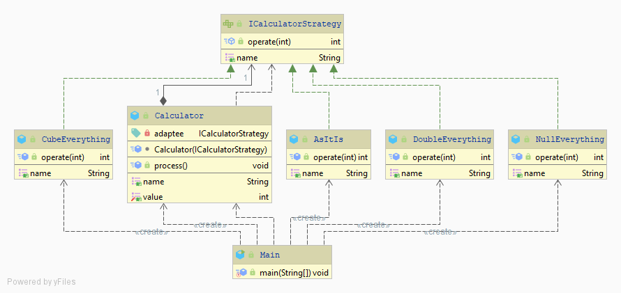

## Strategy Pattern

Simple implementation of the Strategy pattern for Polytech courses.

``Java 8`` needed.



### Strategies used

```
List<Calculator> calculators =  Arrays.asList(
                new Calculator(new NullEverything()),
                new Calculator(new AsItIs()),
                new Calculator(new DoubleEverything()),
                new Calculator(new CubeEverything())
        );
```

### Console output
```
Strategy Pattern 
[NullEverything => 0]
[AsItIs => 3]
[DoubleEverything => 6]
[CubeEverything => 9]
```